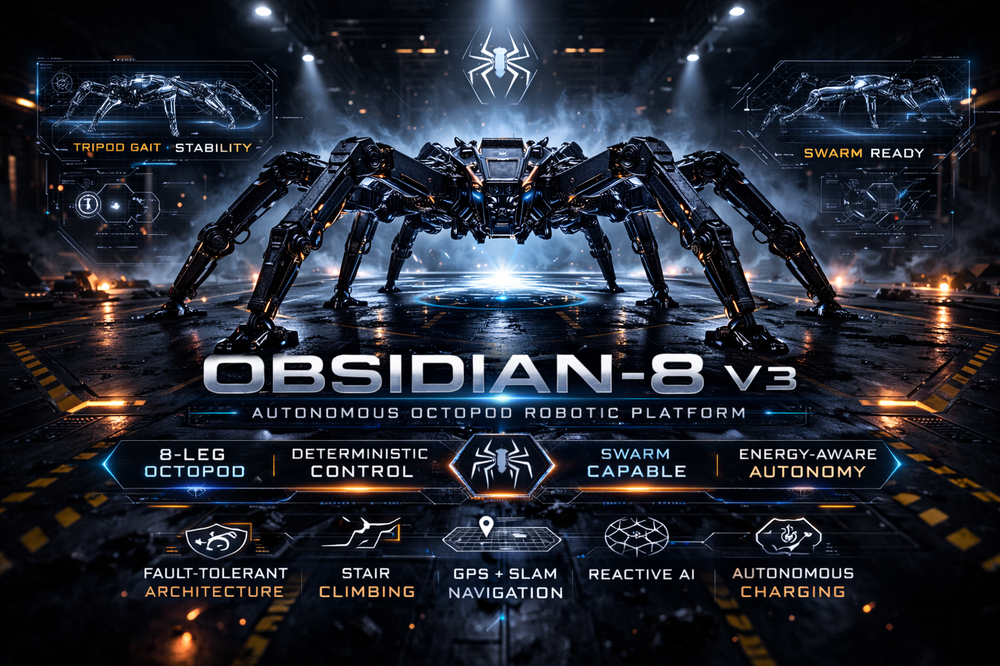

  

<h1 align="center">🕷 OBSIDIAN-8 V3</h1>

<b>Autonomous Octopod Robotics Platform</b> 
Intelligence by Architecture • Safety by Design • Swarm by Default • Energy-Aware

---

<b>Survivability Through Architecture.</b>

---

# 🚀 Executive Overview

OBSIDIAN-8 V3 is a fully systems-engineered 8-legged autonomous spider platform designed for:

- 🌄 Extreme terrain traversal  
- 🧗 Stair ascent and descent  
- 🔄 Load redistribution under actuator loss  
- 🌐 Distributed swarm coordination  
- 🔋 Energy-aware mission planning  
- 🛡 Layered fault containment  
- 🏭 Persistent industrial deployment  

This repository represents a structured robotics architecture baseline — not a prototype experiment.

Architecture is frozen at V3.  
Execution depth now expands from that foundation.

---

# 🕷 Why Eight Legs?

Quadrupeds balance.  
Hexapods adapt.  
**Octopods endure.**

The 8-leg configuration enables:

- ✔ Tripod gait redundancy  
- ✔ Passive stability during partial failure  
- ✔ Dynamic center-of-gravity redistribution  
- ✔ Stable neutral stance under load  
- ✔ Enhanced stair & obstacle negotiation  
- ✔ Mechanical survivability in real terrain  

Resilience is engineered into morphology.

---

# 🧠 What Makes OBSIDIAN-8 Different

Most robotics repositories demonstrate motion.

OBSIDIAN-8 demonstrates:

- Architecture  
- Governance  
- Survivability  
- Lifecycle strategy  
- Swarm scalability  

---

# 📐 Systems Engineering Baseline

Included in this repository:

- 📘 System Requirements Specification  
- 📊 Verification Traceability Matrix  
- ⚠ Formal Risk Register  
- 🔎 Failure Modes & Effects Analysis (FMEA)  
- 🛡 Safety Architecture  
- 🔐 Cybersecurity Threat Model  
- 🌡 Environmental Qualification Plan  
- 🧾 Configuration Management Plan  
- 📈 Lifecycle Phase Planning  

This mirrors aerospace and industrial robotics programs — not hobby builds.

---

# 🛡 Distributed Control Authority Model

OBSIDIAN-8 does not rely on a fragile centralized controller.

It implements:

- 🧠 Compute role separation  
- ❤️ Heartbeat supervision protocol  
- 🚨 Authority escalation model  
- 🔌 Watchdog kill-line architecture  
- 🧯 Fault containment boundaries  
- ⚡ Reactive core isolation  

Failures are contained.  
Authority is hierarchical.  
Safety is dominant.

---

# 🔋 Energy-Aware Autonomy

Energy is treated as a first-class mission variable.

Modeled components include:

- 🔋 LiFePO4 & LiPo discharge modeling  
- 📊 Power budget analysis  
- 🌡 Thermal envelope modeling  
- 🔌 Smart BMS integration strategy  
- 🏠 Autonomous charging logic  
- 🧭 Energy-aware navigation model  

The spider plans around power before movement decisions are made.

---

# 🌐 Swarm-Ready Architecture

OBSIDIAN-8 V3 includes a formal swarm coordination framework:

- 📡 Secure communications model  
- 🧭 Weighted Voronoi sector partitioning  
- 🛰 Shared positional awareness  
- 🔄 Dynamic sector rebalancing  
- 🕸 Advisory coordination layer  

Multiple units can:

- Share terrain maps  
- Partition patrol regions  
- Avoid overlap  
- Coordinate objectives  
- Operate without centralized micromanagement  

Swarm capability is built into architecture — not bolted on later.

---

# 🤖 Core Technical Capabilities

Architected to support:

- 🗺 Hybrid GPS + SLAM navigation  
- 👁 Multi-sensor perception modeling  
- 🧠 Reactive obstacle handling  
- 🏃 Multi-mode gait engine  
- 🔋 Energy-aware path planning  
- 🌐 Swarm sector coordination  
- 🛡 Fault-tolerant operation  
- 📡 Remote mission governance  
- 🔄 Autonomous charging & recovery  

---

# ⚙ Software Architecture

Built around:

- ⚙ ROS2 node graph  
- 🧠 Reactive core engine  
- 🎯 Mission governance layer  
- 🛡 Pi watchdog supervision  
- 🔌 Hardware interface bridges  
- 📦 Modular package structure  

### Status

- 🟢 V3 Architecture Baseline — Locked  
- 🔵 Implementation Alignment — Active  
- 🧪 Hardware Validation — Expanding  

No architectural churn.  
Only deepening and validation.

---

# 🧩 Lifecycle Engineering

OBSIDIAN-8 includes:

- 🧪 Prototype validation framework  
- 🏭 Industrialization planning  
- 📦 Scaled production strategy  
- 🛠 Field operations modeling  
- 🔄 Upgrade & modernization roadmap  
- ♻ Decommissioning strategy  
- 📈 Reliability & maintenance modeling  
- 🔧 Spare parts strategy  

This platform is engineered to evolve — not expire.

---

# 🌍 Target Deployment Domains

- 🏭 Industrial inspection  
- 🛰 Distributed perimeter systems  
- 🌄 Terrain reconnaissance  
- 🕸 Coordinated robotic swarms  
- 🔋 Long-duration autonomous deployment  

---

# 🤝 Collaboration

Active areas of deepening:

- 🔧 ROS2 interface formalization  
- 📡 QoS profile specification  
- 📊 Telemetry calibration vs. power model  
- 🌡 Thermal margin validation  
- 🧠 Swarm message security hardening  
- 📈 Reliability growth modeling  

Engineers interested in distributed robotics, fault-tolerant control, or swarm systems are encouraged to engage.

---

# 🧬 Design Philosophy

> Survivability through architecture.

Redundancy in mechanics.  
Containment in control.  
Energy intelligence in autonomy.  
Scalability in networking.  
Lifecycle planning from inception.

Movement is easy.  
Sustained autonomous operation is not.

---

# 🔥 Long-Term Vision

To develop a scalable family of resilient 8-legged autonomous platforms capable of:

- Persistent deployment  
- Coordinated swarm operation  
- Field survivability  
- Industrial-grade governance  
- Long-duration missions  

Architecture first.  
Execution next.  
Scale deliberately.
